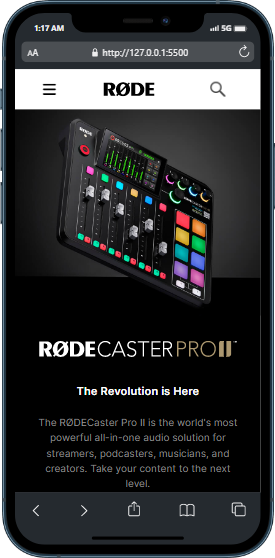
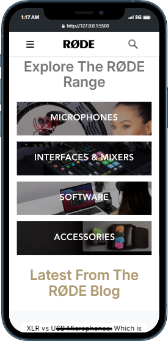
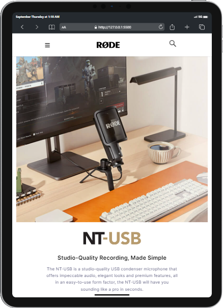
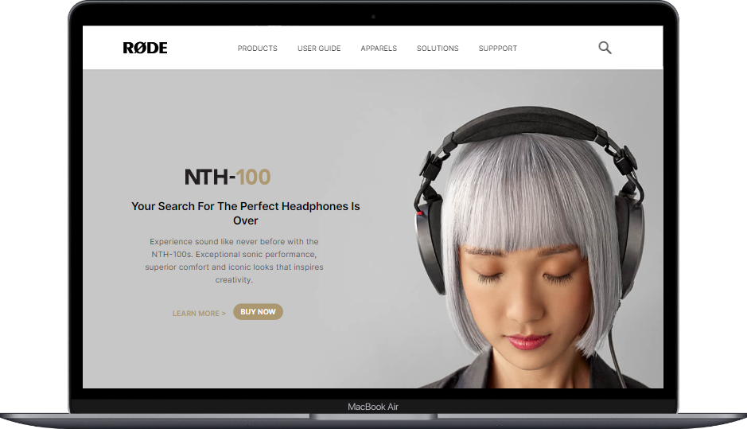
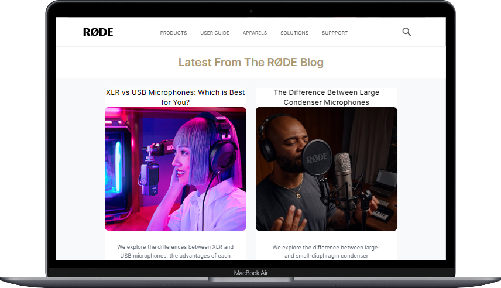

# Rode Landing Page

***
## Description

This project [Rode Landing Page]() was built using Semantic HTML and **Tailwind** from scratch. It took me close to 8 hours to make Rode Landing page clone. . This project helped me a lot in understanding the basic yet effective Tailwind concepts like grid flex, etc. The main learning after building this project is to make complex responsive design simpler and easier and faster with **Tailwindcss** screen breakpoints. The Project was completed under guidance of [Hitesh Choudhary](https://github.com/hiteshchoudhary), CTO Ineuron

***

### Links for Project

* [LIVE Project Link]()

* [Youtube Video Demo]()

* [Source Code]()

***
### Built With 

* Semantic HTML
* Tailwind CSS

***

### Key Learnings

* Learned to handle different images for different screen-size breakpoints
* Learned to make responsive design for all devices without any hassels of media-queries and writing same css again & again
* Learned to read [Tailwinddocs](https://tailwindcss.com/docs/installation) more efficiently
* Used Tailwind components when necessary

***

### Time Taken to finish this project
 

>8 hours to build it from scratch(responsive design).

 

***

### Screencaptures of Project

 

  1. ### Whole Webpage

   

  

   

  2. ### Mobile View

 

 

  3. ### Tablet View 

   

  

   

  4. ### Large Screen View
 
   

  

   
  
  

   

***
 

### Checkout Portfolio & Other Projects

#### [Personal Portfolio]()

#### [Findcoder Profile]()
***

### Connect with Me
* [Mailto](mailto:shubhambhoj3@gmail.com)
* [LinkedIn](https://www.linkedin.com/in/shubham-singh-b122b7171/)
* [Github](https://github.com/ShubhamSingh03)
* [Findcoder]()
***
***
[go to top](#rode-landing-page)